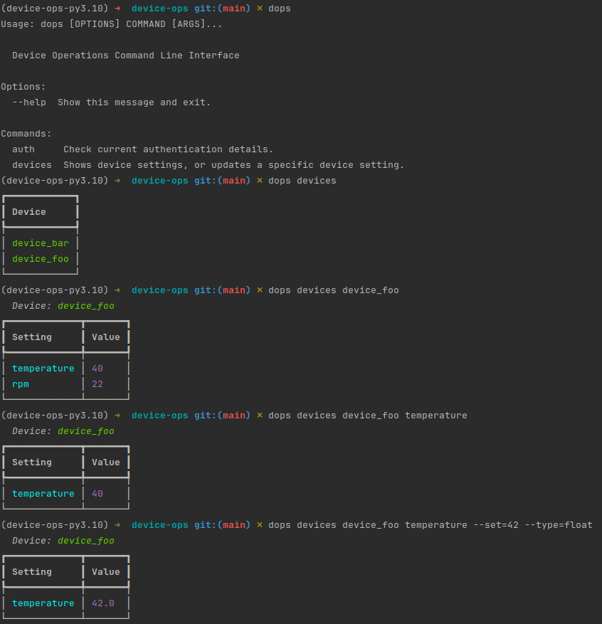

# Device Ops (dops)

Manage settings of devices through a command line client instead of over MQTT.

## Config files

2 files are needed:

- .config
- .secrets


### .config

```dotenv
LOCATION=test
```

### .secrets

```dotenv
MQTT_SERVER_IP=foo.com
MQTT_SERVER_PORT=1234
MQTT_SERVER_USER=my_user
MQTT_SERVER_PASS=my_password
```

## Usage

```bash
# list devices
dops devices
# list settings for a device
dops devices <device_id>
# show a specific setting
dops devices <device_id> <setting_id>
# update the value of a setting (both --set and --type are required)
# valid options for [--type] : --type=float,str,bytes,bytearray
dops devices <device_id> <setting_id> [--set]/[-s] <value> [--type]/[-t] <_type>
```

